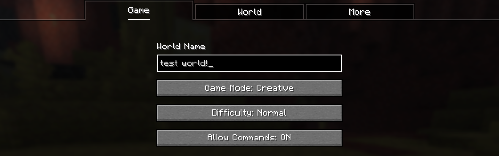
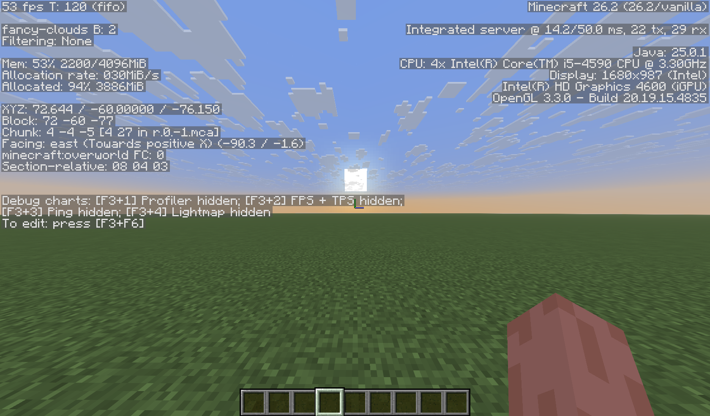
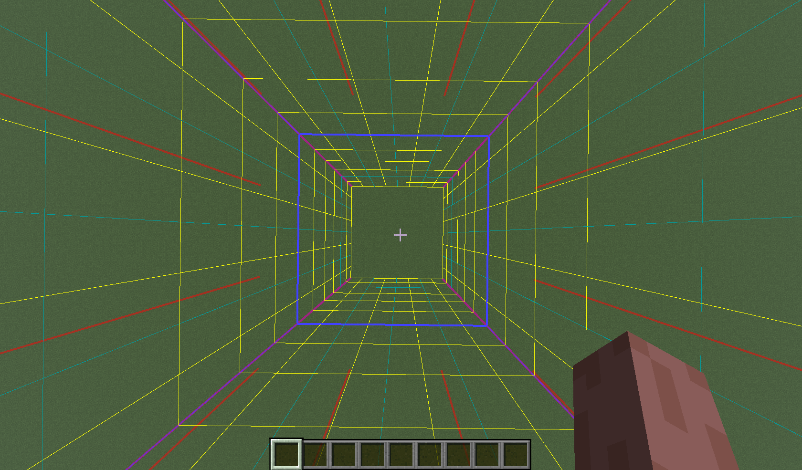
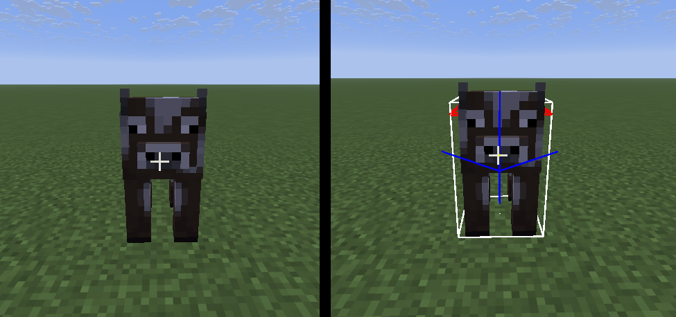
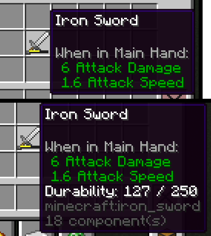
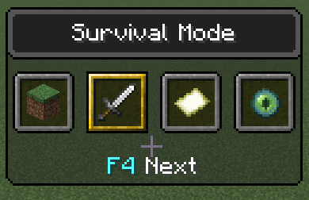

# Chapter 0: Pre-Introduction

This chapter is intended to teach players about important concepts, like the F3 screen, and creating a test world to get started. Feel free to skip ahead to Chapter 1.

### Creating a Test World

The purpose of a test world is to be able to do whatever without having to risk damaging a part of the world. This isn't too important until a bit later.

When creating the world, make sure it's in Creative Mode, and make sure that *Allow Commands* is **on**, like this:

I'd also recommend that the world is a *superflat* world, by going to the *World* tab and clicking *World Type* until it reads "Superflat". From there, you can edit the gamerules, either from world creation, **or** from the pause menu within the world, via *Options* > *World Options* > *Edit Gamerules* (26.1+ only).

> [!IMPORTANT]
>
> Do **not** enable the *Reduce Debug Info* gamerule, as it affects the F3 menu, which we will focus on next.

---

### Coordinates and Chunks

#### Coordinates

Coordinates are what describe precise *positions* inside of Minecraft. A position is made up of 3 coordinates: X, Y and Z, which resembles the 3 dimensions. (e.g. `1, 2, 3`, where X = 1, Y = 2, and Z = 3), where each unit is one block.

A Minecraft world/dimension has an *origin* (or center), which is at the position `0, 0, 0`, which means that coordinates can be *negative*. For example, if you were to move +5 blocks in the X direction from the origin, you'd be at `5, 0, 0`; and if you were to move, say -5 blocks in the Z direction instead, you'd be at `0, 0, -5`.

There is also a correlation to the cardinal directions (north, south, east and west) to the X and Z coordinates:
- Moving in the +X direction means that you're moving **east**,
- Moving in the -X direction means that you're moving **west**,
- Moving in the +Y direction means that you're moving **upwards**,
- Moving in the +Y direction means that you're moving **downwards**,
- Moving in the +Z direction means that you're moving **south**,
- Moving in the -Z direction means that you're moving **north**.

For you you can understand better (I cannot stress how important it is, especially for commands!), let's say you are at the coordinates `550, 90, 275` and you're base is at `200, 90, 525`. If you want to get to your base, you first move 350 blocks *west* (or in the -X direction), then move 250 blocks *south* (or in the +Z direction). If you understand that, then you're good to go.

#### Chunks

A chunk is a 16×16 area of blocks that extends upwards infinitely, and is used in Minecraft for a multitude of things, such as world generation, render/simulation distance, loaded areas, etc. Chunks have their own coordinate systems, that can describe *where* a chunk is, or *where inside of a chunk* something is. That, however, isn't important until later.

---

### The F3 Menu

The F3 menu (or debug menu) is accessible by pressing F3, and gives access to a bunch of information not accessible otherwise. The default F3 menu looks like this:

Don't worry about most of this text, as it's not important; there are a couple of things that are useful:

1. The text at the very top right corner, is your FPS, or frames per second. This is how often your computer can refresh the screen.

2. Where it says "Integrated server @ 14.2/50ms" displays your world's TPS, or ticks per second. The "14.2" tells you how fast Minecraft was able to perform all of the necessary actions to advance to the next game tick. The tick system will be explained in this chapter.

3. Where it says *XYZ* shows your player's position (AKA, your coordinates), where the first number is your X position, the second is your Y position, and the third is your Z position.

4. Where it says *Block* shows the block coordinate you are occupying. This is what Minecraft uses for block positions.

5. Where it says *Chunk* shows what chunk you're in.

6. Where it says *Facing* tells you the cardinal direction you are *most* facing, where that goes towards, and your precise rotation in parentheses; the first number is your horizontal rotation, whereas the second is your vertical rotation.

7. Where it says *Section-relative*, is your coordinate within the chunk you are in. Chunks will be explained in this chapter as well.

There's a lot more than this, by pressing F3 + F6, but this chapter won't dive deep into that; this chapter is already **very long**!

---

### Debug Keybinds

Here are some useful keybinds, with visuals to understand what they do:

- Pressing F3 + G toggles chunk borders. The purple lines indicate the chunk you're in, and the red lines indicate other chunk corners. Here's what it looks like:

- Pressing F3 + B toggles entity hitboxes, which is what Minecraft uses to determine collision and where it can be hit. An arrow appears in the direction the entity is facing. Here's what that looks like with a cow, with a comparison. Hitboxes are disabled on the left, and *enabled* on the right

- Pressing F3 + H toggles advanced tooltips, which shows extra information when you hover over items, like the item's ID, durability, etc. Here's what it looks like with a damaged sword: 

<!-- This figure might need improvement lol -->

- Holding F3 + F4 brings up the gamemode switcher, which allows you to quickly change gamemodes. The menu looks like this: 

  The selected gamemode is highlighted in **yellow**. When you press F3 + F4, Let go of F4 to prevent choosing constantly. To choose a different gamemode, press F4 to go to the right. Once you've chosen a gamemode, release F3.
  > [!TIP]
  >
  > If you press F3 + F4 but quickly let go of *both*, it switches you to the last gamemode you were in.

- Pressing F3 + N switches between *Spectator* mode and your previous gamemode.
- Pressing F3 + D clears the chat.
- Pressing F3 + T refreshes your resource packs.
- Pressing F3 + L starts a debugging profile, and this keybind only works in singleplayer. We'll go into profiling *far* into the future, so don't worry about this.

---

### Server vs Client

Don't worry if you don't understand this, it's not important until you go further in the book. 

All of the logic on a Minecraft world is done on a **server**, including on singleplayer and LAN worlds, where your computer acts like the server host that you connect to. However, each induvidual *client* (or player) handles rendering their view of the game, and other updates and events that they might send or receive to and from the server. 

For example, if someone places a block, that event is sent to the server for validation, and if it succeeds, the server will update the world, so that everyone can see that block; that event is what's called **server-sided**. But, if you were to enable something like resource pack, only you are affected by it; that event is **client-sided**.

---

### The Tick System

Minecraft normally runs at 20 TPS (ticks per second), where one tick is completed within 0.05 seconds, or 50 milliseconds. In other words, all logic inside of Minecraft, from chunk generation, to player inputs, to mob AI, update once every 50 milliseconds; that's it! 

---

Now that I've cleared up everything, let us truly begin our journey from zero to hero in commands and datapacks.