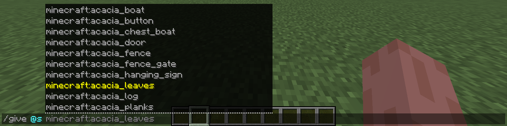
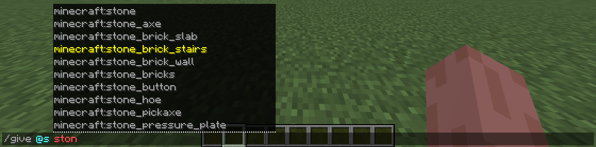

# Chapter 3: Expanding Your Syntax Game - Continued

This chapter is a continuation of the last chapter, and will focus on more argument datatypes, as well as extra commands, and most importantly command auto-complete.

### Items and The `give` Command

The `give` command allows you to give items to yourself and other players in any quantity, up to 100 stacks. This is its syntax:
```
/give <targets> <item> [<count>]
```
Now here's what every argument does:
- `<targets>` expects a target datatype (See [Chapter 2](./chapter_2.md)), though here it **only allows players**;
- `<item>` expects a valid item ID (e.g. `minecraft:diamond`), and can accept optional components. Components are something you learn *far* into the future, so don't worry about them; and
- `[<count>]` expects a positive integer, and is how many of `<item>` you'll be given. Note that this is optional, hence the brackets (`[]`). If not specified, you get exactly one of `<item>`.

---

### The Power of Auto-Complete

If you started filling out the command by now (if you haven't, type `/give @s` but don't press *Enter*), you'll see something like this above the command bar:



That box above the command bar is **auto-complete**. Here, it gives you all of the possible item IDs that are permitted for the `<item>` argument. To pick the item from here, either press the *Tab* key on your keyboard, or click on one of the options. You can also scroll inside the box, hence the dotted line in between the command bar and the box.

> [!IMPORTANT]
>
> Don't see this box? It's likely disabled. To enable it, pause the game, go under *Options* > *Chat Settings* and turn *Command Suggestions* on.

Now scrolling through options is quite painful. What happens if we start typing, say `ston`?



You can see that every item ID that has the phrase `ston` in it will be the only ones listed. I didn't use `stone` for the example above because it's a valid item ID, and auto-complete won't show if you fill in a valid argument via typing.

This removes a **lot** of the burden of memorizing most argument fields. There are still a lot of things that don't support auto-complete: such as the `[<count>]` field, since it's just a number; and more complex arguments that will be covered in the future.

---

### Blocks and the `setblock` command

The `setblock` command allows you to place a block at a specific position. Blocks that normally have to be supported underneath (e.g. flowers) can be placed mid-air or in otherwise 'illegal' positions. Here is its syntax:
```
/setblock <pos> <block> [destroy|keep|replace|strict]
```
Let's go over the arguments:
- `<pos>` expects coordinates, which is where the block will be placed. This position **must be loaded** (see [Chapter 0](chapter_0.md)); 
- `<block>` expects a block ID (e.g. `minecraft:crafting_table`), where other data can be specified, such as blockstates (don't worry about blockstates now). You can use auto-complete here.

The argument in brackets (`[]`) indicates that there are 4 valid options, but you can only pick one; the field is still optional however. Here are what those options do:

- `destroy` works like normal, if it replaces a block, the destroyed block will drop as if it were broken by a diamond pickaxe. (e.g. a Grass Block will drop Dirt, Stone will drop Cobblestone, and unbreakable blocks drop nothing);

- `keep` only works if it **doesn't** replace a block, it fails otherwise;

- `replace` is the default if the field is left empty; and

- `strict` makes the placed block not apply block updates. For example, if you placed a gravity-affected block in the air (e.g. `setblock ~ ~ ~ sand`) without adding `strict`, it'd fall once the command is run; but if you did something like `setblock ~ ~ ~ sand strict`, the sand block wouldn't fall until it received another update.

---

### Entities and the `summon` Command 

The `summon` command allows you to spawn any entity at will, and at any position. Here's its syntax:
```
/summon <entity> [<pos>] [<nbt>]
```
This is what every argument does:

- `<entity>` expects an entity ID (e.g. `minecraft:creeper`), and is what mob will be summoned. You can use auto-complete here;
- `[<pos>]` expects a position datatype, and is where the entity will be summoned. If left empty, the entity is summoned at your position; and
- `[<nbt>]` allows you to attach custom data to the entity, called *NBT* data. Do not worry about this, as NBT is one of **the most** complex mechanics in command/datapack development, and will be learned *far* in the future.

> [!TIP]
>
> To save typing, when talking about block IDs, item IDs, entity IDs, etc., the `minecraft:` part is always optional, and doesn't need to be written.

---

### Examples

Now, here are multiple examples for each command that you've learned this chapter:

- `/give @a diamond_sword` - gives all players a Diamond Sword;
- `/give @s netherite_block 64` - gives you 64 *very* valuable blocks;
- `/setblock ~ ~ ~ diamond_block` - sets the block at your feet to a Diamond Block;
- `/setblock ~ ~5 ~ anvil strict` - allows you to place an anvil mid-air without it falling, regardless of if it's supported by another block;
- `/summon cow 12 34 56` - summons a cow at an arbitrary position;
- `/summon ender_dragon` - unleashes the Ender Dragon, (likely) wreaking havoc on your world. **I'd advise against this one though**, as it's quite destructive.

---
### Summary

Even though this chapter was short, you've learned a lot here, mainly
- 3 new commands: `give`, `setblock`, and `summon`; and
- the auto-complete feature, which will save you a *lot* of time.

Chapter 4 will go over *target selector arguments*, which allow you to select entities by type, distance and *much* more.